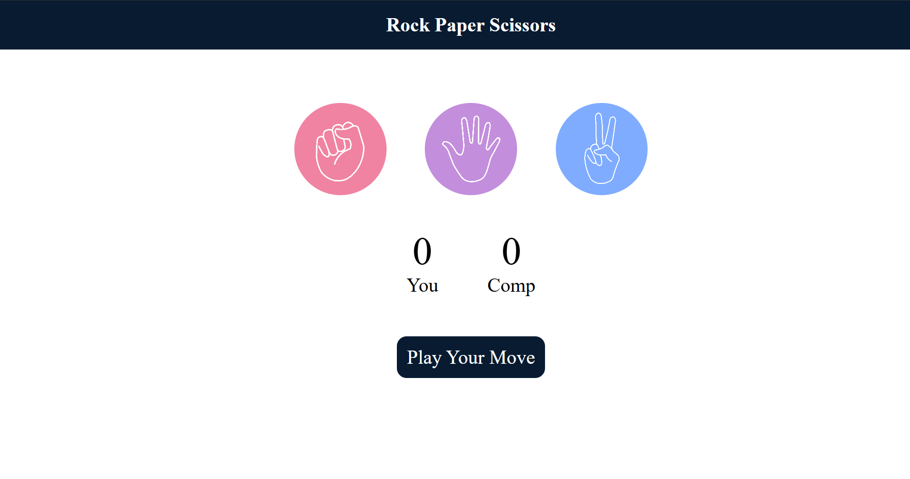

# Rock Paper Scissors Game 🎮

A simple and interactive **Rock Paper Scissors** mini web game built using **HTML, CSS, and JavaScript**.  
It allows the user to play against the computer with **real-time score updates** and instant result messages.

---

## 🚀 Features

- ✅ User vs Computer gameplay  
- ✅ Random computer move generation  
- ✅ Live score tracking (You vs Computer)  
- ✅ Result message display (Win / Lose / Draw)  
- ✅ Clean and responsive UI  
- ✅ Beginner-friendly JavaScript logic  

---

## 🛠️ Tech Stack

- **HTML** – Structure of the game
- **CSS** – Styling and UI design
- **JavaScript** – Game logic & DOM manipulation

---

## 📂 Project Structure

Rock-Paper-Scissors-Game/
│
├── index.html
├── style.css
├── script.js
└── Images/
├── rock.png
├── paper.png
└── scissors.png


---

## 🎯 How to Play

1. Open the game in your browser.
2. Choose one move:
   - 🪨 Rock  
   - 📄 Paper  
   - ✂️ Scissors  
3. The computer will automatically choose a random move.
4. The winner is decided instantly and the score updates.

---

## 🧠 Game Rules

- **Rock beats Scissors**
- **Scissors beats Paper**
- **Paper beats Rock**
- Same choice = **Draw**

---

## ▶️ Run Locally

1. Clone this repository:
   ```bash
   git clone https://github.com/your-username/Rock-Paper-Scissors-Game.git

2. Open the folder:

   cd Rock-Paper-Scissors-Game

3. Run the project by opening index.html in your browser
   (or use Live Server in VS Code for best experience)
